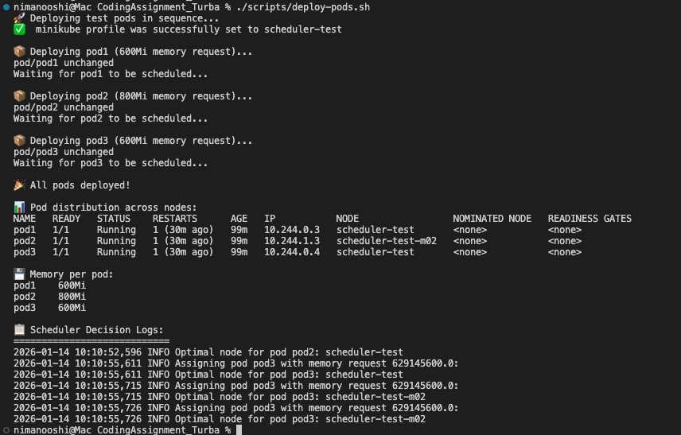

# Custom Kubernetes Scheduler Assignment

## Approach

The goal here is to deploy a custom scheduler that balances memory allocation across nodes to minimize the risk of pod evictions. Since the provided `scheduler.py` uses `load_incluster_config()`, it expects to run inside a Kubernetes cluster - not on my local machine directly. So the approach I took was:

1. Containerize the scheduler using Docker
2. Deploy it as a pod inside a local minikube cluster
3. Give it the necessary RBAC permissions to watch pods and bind them to nodes
4. Deploy the test pods and let the custom scheduler handle placement

---

## Scripts Explained

### setup-cluster.sh

This script creates a 2-node minikube cluster. It first deletes any existing cluster with the same name to start fresh, then spins up a new cluster with the `scheduler-test` profile.

Each node is configured with 2GB of memory. The script waits for both nodes to reach Ready status before finishing.

### deploy-scheduler.sh

This is where the scheduler gets built and deployed. The steps are:

1. Copy `scheduler.py` from the Task Files directory
2. Build a Docker image containing Python and the kubernetes client library
3. Load that image into minikube (so the cluster can access it)
4. Apply the RBAC permissions (more on this below)
5. Apply the deployment manifest that actually runs the scheduler

The script waits until the scheduler pod is running before finishing. It also prints the initial logs so I can see it started correctly.

### deploy-pods.sh

This script deploys the three test pods one at a time with a short delay between each. The delay gives the scheduler time to make its decision and log it before the next pod arrives.

After all pods are deployed, it shows:
- Where each pod ended up (which node)
- The memory request for each pod
- The scheduler's decision logs

Those logs are the key evidence that my custom scheduler was used.

### verify-deployment.sh

A utility script that shows the current state of everything:
- Cluster nodes
- Scheduler pod status
- Test pod placements
- Memory distribution per node
- Scheduler logs

Useful for checking that everything is working correctly.

### cleanup-pods.sh

Deletes the three test pods so I can redeploy them for another test run. Does not touch the scheduler - just the workload pods.

---

## RBAC Configuration

The scheduler needs permissions to interact with the Kubernetes API. The `scheduler-rbac.yaml` file sets up:

1. A ServiceAccount called `custom-scheduler` - this is the identity the scheduler pod uses
2. A ClusterRole with the minimal permissions needed:
   - Read and watch pods (to know when new pods need scheduling)
   - Read nodes (to know where pods can be placed)
   - Create bindings (to actually assign pods to nodes)
3. A ClusterRoleBinding that connects the ServiceAccount to the ClusterRole

Without these permissions, the scheduler would get "Forbidden" errors when trying to list pods or bind them to nodes.

---

## Scheduler Deployment

The `scheduler-deployment.yaml` file tells Kubernetes how to run the scheduler:

- Runs in the `kube-system` namespace
- Uses the custom-scheduler ServiceAccount (for RBAC)
- Sets `NODE_MEM_LIMIT_MB=2048` as an environment variable
- Uses `imagePullPolicy: Never` since the image is built locally, not pulled from a registry

---

## The Allocation Algorithm

The scheduler implements what I would call a "least-loaded" placement strategy. Here is how it works:

When a new pod arrives, the scheduler:

1. Calculates how much memory the pod is requesting
2. Looks up how much memory is already allocated on each node (sum of all running pods)
3. Filters out any node that does not have enough remaining capacity
4. Among the remaining nodes, picks the one with the lowest current memory usage

This always chooses the least-loaded node, which spreads the workload evenly and minimizes the chance of any single node running out of memory.

---

## Why Pods Are Placed Where They Are

Pod memory requests: pod1 (600Mi), pod2 (800Mi), pod3 (600Mi).

| Step | Pod | Node State Before | Decision |
|------|-----|-------------------|----------|
| 1 | pod1 | Both at 0Mi | Goes to first node (tie-breaker) |
| 2 | pod2 | Node1: 600Mi, Node2: 0Mi | Goes to Node2 (least loaded) |
| 3 | pod3 | Node1: 600Mi, Node2: 800Mi | Goes to Node1 (least loaded) |

Final: Node1 has 1200Mi (pod1+pod3), Node2 has 800Mi (pod2).

